# Wedding Invitation Web Application Design

## Overview

A web-based online wedding invitation application that allows couples to create, customize, and share beautiful digital wedding invitations. The application prioritizes mobile-first design to ensure optimal user experience across all devices, with particular focus on smartphone and tablet interactions.

**Target Users:**
- Engaged couples planning their wedding
- Wedding guests viewing and responding to invitations
- Wedding planners managing multiple events

**Core Value Proposition:**
- Easy-to-use digital invitation creation
- Mobile-optimized viewing experience
- Real-time RSVP management
- Social sharing capabilities
- Cost-effective alternative to traditional paper invitations

## Technology Stack & Dependencies

**Frontend Framework:** React 18+ with TypeScript
**Styling:** Tailwind CSS with custom wedding-themed components
**State Management:** Zustand for lightweight state management
**Routing:** React Router v6
**Form Handling:** React Hook Form with Zod validation
**Image Processing:** React Image Crop for photo editing
**Animation:** Framer Motion for smooth transitions
**PWA Support:** Service Worker for offline capabilities
**Build Tool:** Vite for fast development and optimized builds

## Component Architecture

### Component Hierarchy

```
Components Structure:
├── App (Root Component)
├── Layout Components
│   ├── Header (Navigation, Logo)
│   ├── Footer (Contact, Legal)
│   └── MobileNavigation (Bottom Tab Bar)
├── Page Components
│   ├── HomePage (Landing Page)
│   ├── InvitationCreator (Builder Interface)
│   ├── InvitationViewer (Guest View)
│   ├── RSVPPage (Response Form)
│   └── Dashboard (Couple's Management)
├── Feature Components
│   ├── TemplateSelector
│   ├── CustomizationPanel
│   ├── GuestListManager
│   ├── RSVPTracker
│   └── ShareModal
└── UI Components
    ├── Button (Primary, Secondary, Icon)
    ├── Input (Text, Email, Phone, Date)
    ├── Card (Invitation Preview)
    ├── Modal (Overlay, Drawer)
    └── Loading (Spinner, Skeleton)
```

### Props/State Management

**Global State (Zustand):**
```typescript
interface AppState {
  // User Authentication
  user: User | null
  isAuthenticated: boolean
  
  // Invitation Data
  currentInvitation: Invitation | null
  templates: Template[]
  
  // Guest Management
  guestList: Guest[]
  rsvpResponses: RSVP[]
  
  // UI State
  isMobile: boolean
  isOnline: boolean
  activeModal: string | null
}
```

## Detailed Action Flows

### Core User Action Flows

#### Invitation Creation Action Flow

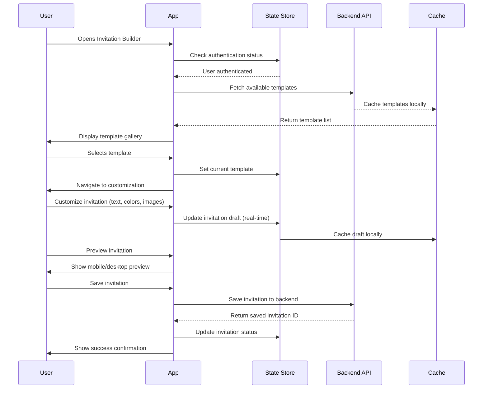
```mermaid
sequenceDiagram
    participant U as User
    participant A as App
    participant S as State Store
    participant API as Backend API
    participant C as Cache
    
    U->>A: Opens Invitation Builder
    A->>S: Check authentication status
    S-->>A: User authenticated
    A->>API: Fetch available templates
    API-->>C: Cache templates locally
    C-->>A: Return template list
    A->>U: Display template gallery
    
    U->>A: Selects template
    A->>S: Set current template
    A->>U: Navigate to customization
    
    U->>A: Customize invitation (text, colors, images)
    A->>S: Update invitation draft (real-time)
    S->>C: Cache draft locally
    
    U->>A: Preview invitation
    A->>U: Show mobile/desktop preview
    
    U->>A: Save invitation
    A->>API: Save invitation to backend
    API-->>A: Return saved invitation ID
    A->>S: Update invitation status
    A->>U: Show success confirmation
```

#### Guest RSVP Action Flow

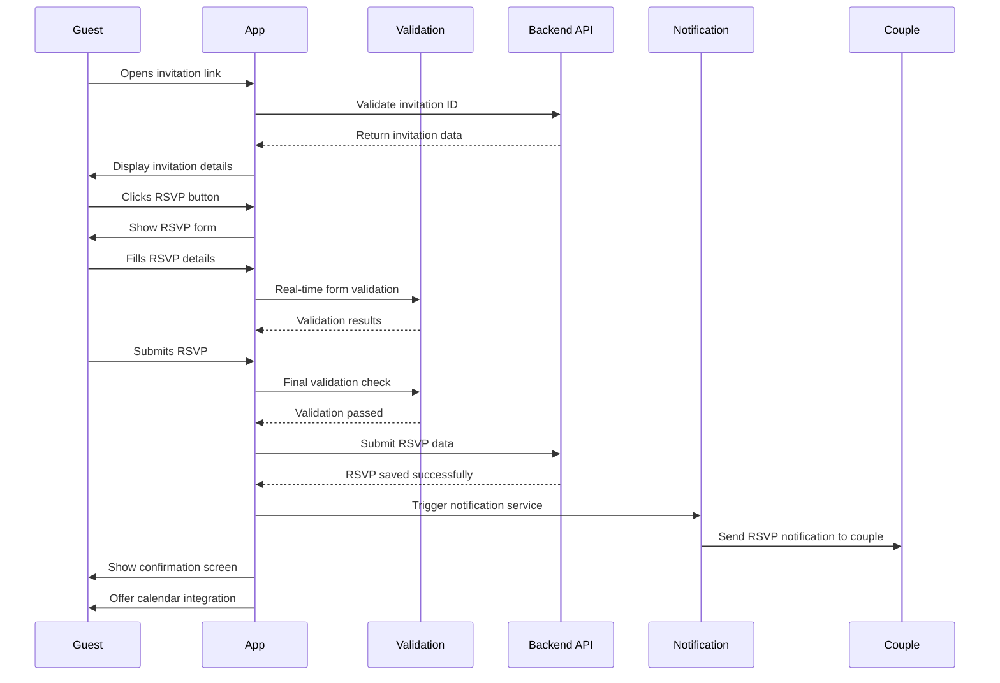
```mermaid
sequenceDiagram
    participant G as Guest
    participant A as App
    participant V as Validation
    participant API as Backend API
    participant N as Notification
    participant C as Couple
    
    G->>A: Opens invitation link
    A->>API: Validate invitation ID
    API-->>A: Return invitation data
    A->>G: Display invitation details
    
    G->>A: Clicks RSVP button
    A->>G: Show RSVP form
    
    G->>A: Fills RSVP details
    A->>V: Real-time form validation
    V-->>A: Validation results
    
    G->>A: Submits RSVP
    A->>V: Final validation check
    V-->>A: Validation passed
    A->>API: Submit RSVP data
    API-->>A: RSVP saved successfully
    
    A->>N: Trigger notification service
    N->>C: Send RSVP notification to couple
    
    A->>G: Show confirmation screen
    A->>G: Offer calendar integration
```

#### Template Browsing Action Flow

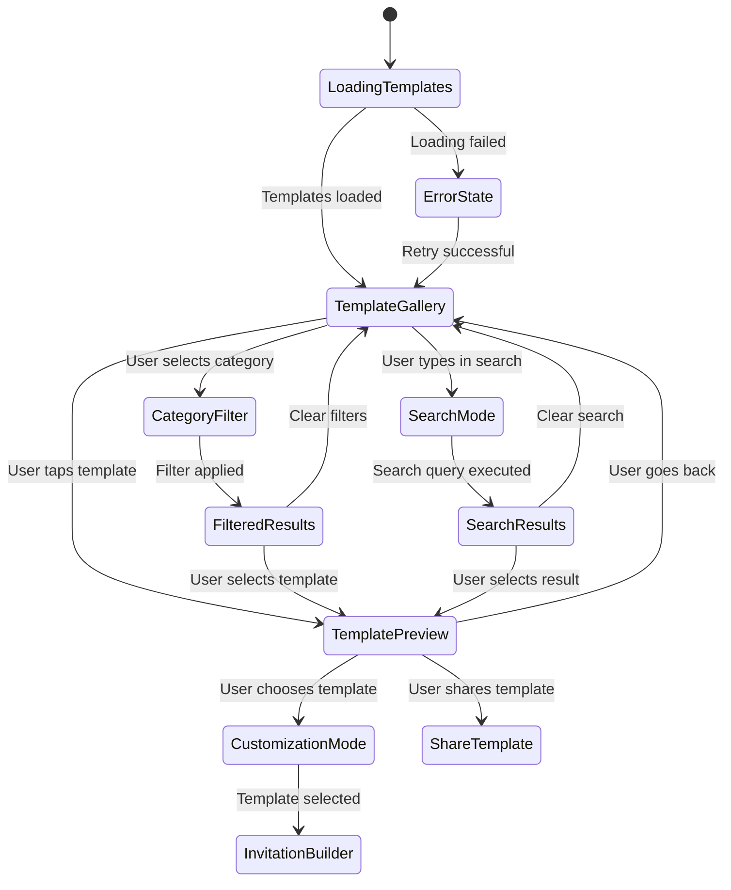
```mermaid
stateDiagram-v2
    [*] --> LoadingTemplates
    
    LoadingTemplates --> TemplateGallery : Templates loaded
    LoadingTemplates --> ErrorState : Loading failed
    
    TemplateGallery --> CategoryFilter : User selects category
    TemplateGallery --> TemplatePreview : User taps template
    TemplateGallery --> SearchMode : User types in search
    
    CategoryFilter --> FilteredResults : Filter applied
    FilteredResults --> TemplatePreview : User selects template
    FilteredResults --> TemplateGallery : Clear filters
    
    SearchMode --> SearchResults : Search query executed
    SearchResults --> TemplatePreview : User selects result
    SearchResults --> TemplateGallery : Clear search
    
    TemplatePreview --> CustomizationMode : User chooses template
    TemplatePreview --> TemplateGallery : User goes back
    TemplatePreview --> ShareTemplate : User shares template
    
    CustomizationMode --> InvitationBuilder : Template selected
    ErrorState --> TemplateGallery : Retry successful
```

### Mobile-Specific Action Flows

#### Touch Interaction Flow

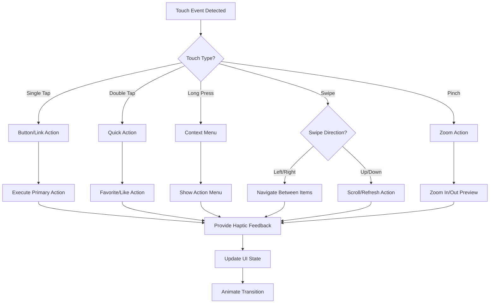
```mermaid
flowchart TD
    A[Touch Event Detected] --> B{Touch Type?}
    
    B -->|Single Tap| C[Button/Link Action]
    B -->|Double Tap| D[Quick Action]
    B -->|Long Press| E[Context Menu]
    B -->|Swipe| F{Swipe Direction?}
    B -->|Pinch| G[Zoom Action]
    
    C --> H[Execute Primary Action]
    D --> I[Favorite/Like Action]
    E --> J[Show Action Menu]
    
    F -->|Left/Right| K[Navigate Between Items]
    F -->|Up/Down| L[Scroll/Refresh Action]
    
    G --> M[Zoom In/Out Preview]
    
    H --> N[Provide Haptic Feedback]
    I --> N
    J --> N
    K --> N
    L --> N
    M --> N
    
    N --> O[Update UI State]
    O --> P[Animate Transition]
```

#### Offline Mode Action Flow

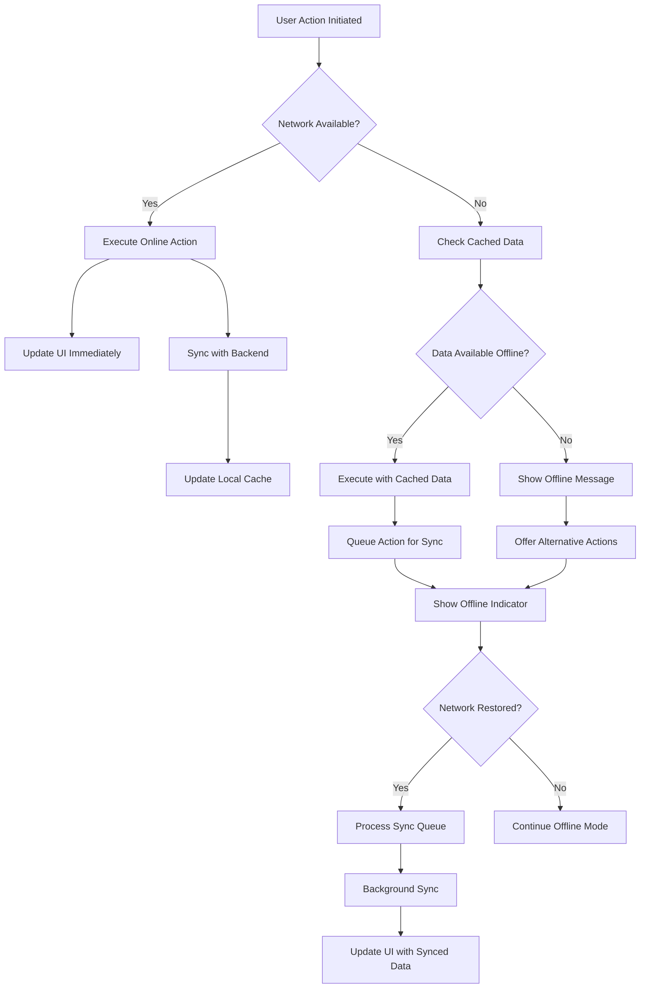
```mermaid
flowchart TD
    A[User Action Initiated] --> B{Network Available?}
    
    B -->|Yes| C[Execute Online Action]
    B -->|No| D[Check Cached Data]
    
    C --> E[Update UI Immediately]
    C --> F[Sync with Backend]
    F --> G[Update Local Cache]
    
    D --> H{Data Available Offline?}
    H -->|Yes| I[Execute with Cached Data]
    H -->|No| J[Show Offline Message]
    
    I --> K[Queue Action for Sync]
    J --> L[Offer Alternative Actions]
    
    K --> M[Show Offline Indicator]
    L --> M
    
    M --> N{Network Restored?}
    N -->|Yes| O[Process Sync Queue]
    N -->|No| P[Continue Offline Mode]
    
    O --> Q[Background Sync]
    Q --> R[Update UI with Synced Data]
```

### Data Flow Actions

#### State Management Action Flow

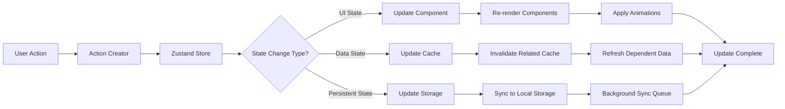
```mermaid
flowchart LR
    A[User Action] --> B[Action Creator]
    B --> C[Zustand Store]
    
    C --> D{State Change Type?}
    
    D -->|UI State| E[Update Component]
    D -->|Data State| F[Update Cache]
    D -->|Persistent State| G[Update Storage]
    
    E --> H[Re-render Components]
    F --> I[Invalidate Related Cache]
    G --> J[Sync to Local Storage]
    
    H --> K[Apply Animations]
    I --> L[Refresh Dependent Data]
    J --> M[Background Sync Queue]
    
    K --> N[Update Complete]
    L --> N
    M --> N
```

#### Error Handling Action Flow

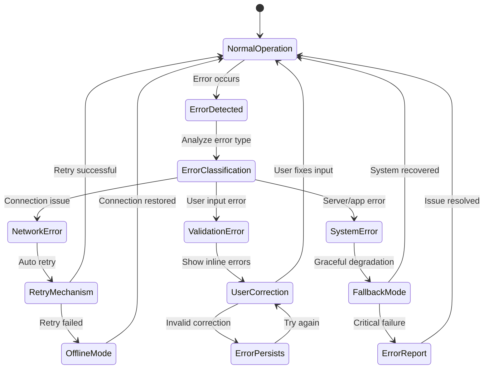
```mermaid
stateDiagram-v2
    [*] --> NormalOperation
    
    NormalOperation --> ErrorDetected : Error occurs
    
    ErrorDetected --> ErrorClassification : Analyze error type
    
    ErrorClassification --> NetworkError : Connection issue
    ErrorClassification --> ValidationError : User input error
    ErrorClassification --> SystemError : Server/app error
    
    NetworkError --> RetryMechanism : Auto retry
    ValidationError --> UserCorrection : Show inline errors
    SystemError --> FallbackMode : Graceful degradation
    
    RetryMechanism --> NormalOperation : Retry successful
    RetryMechanism --> OfflineMode : Retry failed
    
    UserCorrection --> NormalOperation : User fixes input
    UserCorrection --> ErrorPersists : Invalid correction
    
    FallbackMode --> NormalOperation : System recovered
    FallbackMode --> ErrorReport : Critical failure
    
    OfflineMode --> NormalOperation : Connection restored
    ErrorPersists --> UserCorrection : Try again
    ErrorReport --> NormalOperation : Issue resolved
```

### Integration Action Flows

#### Social Sharing Action Flow

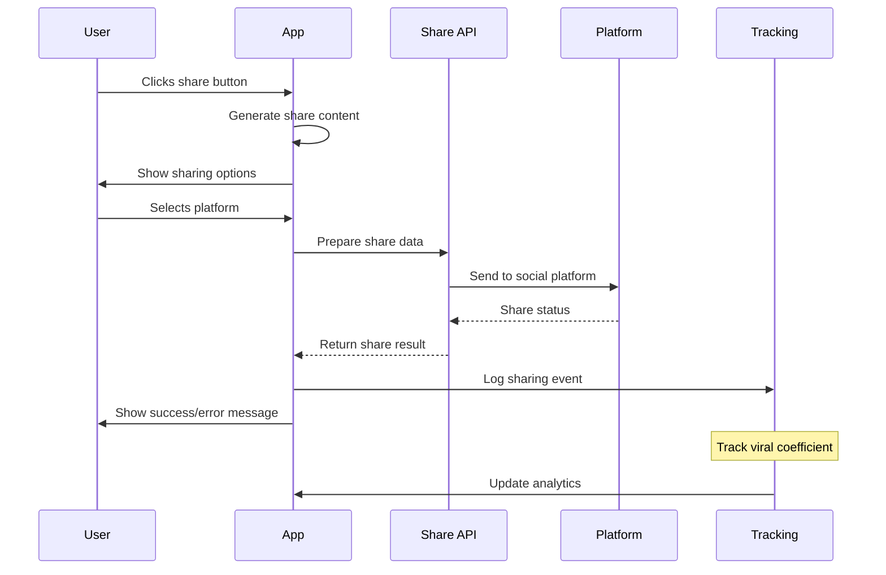
```mermaid
sequenceDiagram
    participant U as User
    participant A as App
    participant S as Share API
    participant P as Platform
    participant T as Tracking
    
    U->>A: Clicks share button
    A->>A: Generate share content
    A->>U: Show sharing options
    
    U->>A: Selects platform
    A->>S: Prepare share data
    S->>P: Send to social platform
    
    P-->>S: Share status
    S-->>A: Return share result
    
    A->>T: Log sharing event
    A->>U: Show success/error message
    
    Note over T: Track viral coefficient
    T->>A: Update analytics
```

#### Calendar Integration Action Flow

```mermaid
flowchart TD
    A[User Submits RSVP] --> B[Show Calendar Options]
    
    B --> C{Platform Detected?}
    
    C -->|iOS| D[Apple Calendar]
    C -->|Android| E[Google Calendar]
    C -->|Web| F[Multiple Options]
    
    D --> G[Generate ICS File]
    E --> H[Calendar API Call]
    F --> I[Show Platform Chooser]
    
    G --> J[Open Calendar App]
    H --> K[Add Event Directly]
    I --> L[Generate Universal Link]
    
    J --> M[Pre-filled Event Details]
    K --> N[Confirm Event Added]
    L --> O[User Selects Platform]
    
    M --> P[User Saves Event]
    N --> Q[Show Success Message]
    O --> G
    
    P --> Q
    Q --> R[Return to Invitation]

### Advanced Action Flows

#### Guest List Management Action Flow

```mermaid
flowchart TD
    A[Open Guest Management] --> B{Guest List Empty?}
    
    B -->|Yes| C[Show Onboarding]
    B -->|No| D[Display Guest List]
    
    C --> E[Add Guest Options]
    E --> F{Add Method?}
    
    F -->|Manual| G[Single Guest Form]
    F -->|Import| H[Contact Import]
    F -->|Bulk| I[CSV Upload]
    
    G --> J[Validate Guest Data]
    H --> K[Request Contact Permission]
    I --> L[Parse CSV File]
    
    J --> M{Validation Passed?}
    K --> N{Permission Granted?}
    L --> O{Valid CSV Format?}
    
    M -->|Yes| P[Save Guest]
    M -->|No| Q[Show Validation Errors]
    
    N -->|Yes| R[Access Contact List]
    N -->|No| S[Fallback to Manual]
    
    O -->|Yes| T[Preview Import Data]
    O -->|No| U[Show Format Error]
    
    P --> D
    Q --> G
    S --> G
    U --> I
    
    R --> V[Select Multiple Contacts]
    V --> W[Import Selected Guests]
    W --> D
    
    T --> X[Confirm Import]
    X --> Y[Batch Save Guests]
    Y --> D
```

#### Real-time Collaboration Action Flow

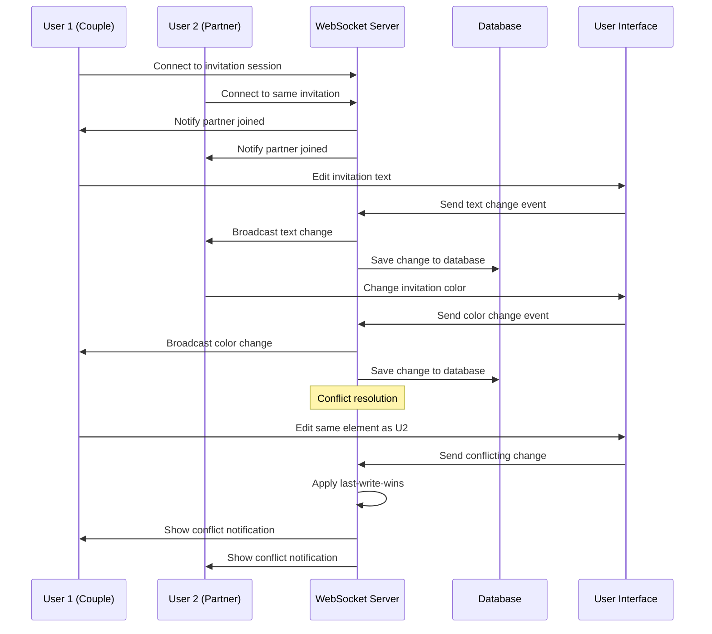
```mermaid
sequenceDiagram
    participant U1 as User 1 (Couple)
    participant U2 as User 2 (Partner)
    participant WS as WebSocket Server
    participant DB as Database
    participant UI as User Interface
    
    U1->>WS: Connect to invitation session
    U2->>WS: Connect to same invitation
    WS->>U1: Notify partner joined
    WS->>U2: Notify partner joined
    
    U1->>UI: Edit invitation text
    UI->>WS: Send text change event
    WS->>U2: Broadcast text change
    WS->>DB: Save change to database
    
    U2->>UI: Change invitation color
    UI->>WS: Send color change event
    WS->>U1: Broadcast color change
    WS->>DB: Save change to database
    
    Note over WS: Conflict resolution
    U1->>UI: Edit same element as U2
    UI->>WS: Send conflicting change
    WS->>WS: Apply last-write-wins
    WS->>U1: Show conflict notification
    WS->>U2: Show conflict notification
```

#### Payment Processing Action Flow

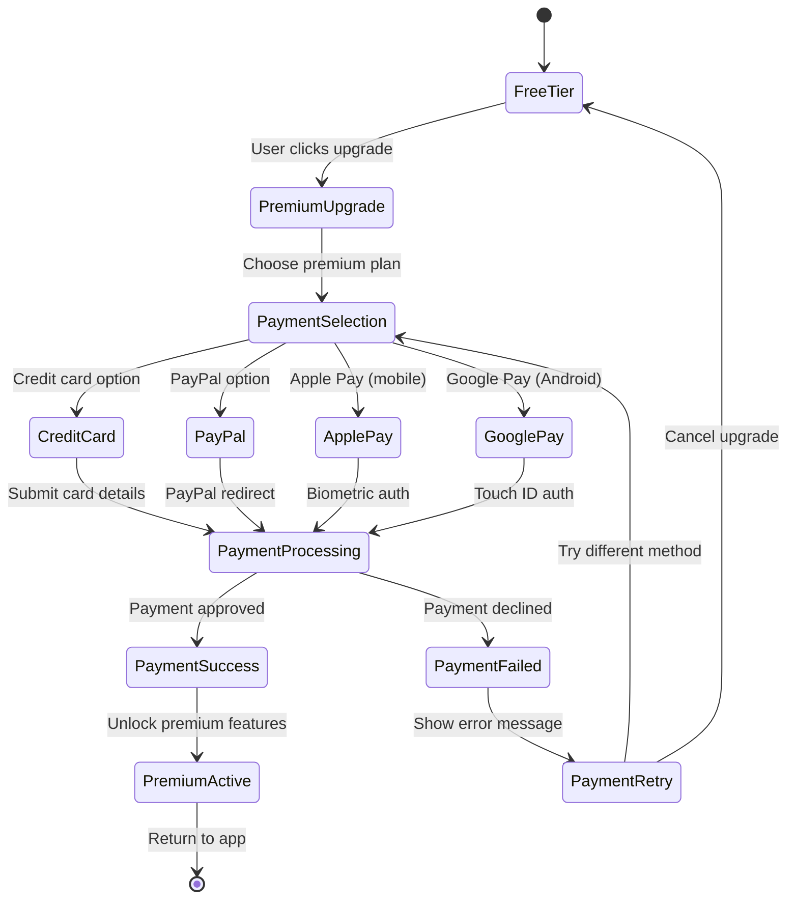
```mermaid
stateDiagram-v2
    [*] --> FreeTier
    
    FreeTier --> PremiumUpgrade : User clicks upgrade
    
    PremiumUpgrade --> PaymentSelection : Choose premium plan
    
    PaymentSelection --> CreditCard : Credit card option
    PaymentSelection --> PayPal : PayPal option
    PaymentSelection --> ApplePay : Apple Pay (mobile)
    PaymentSelection --> GooglePay : Google Pay (Android)
    
    CreditCard --> PaymentProcessing : Submit card details
    PayPal --> PaymentProcessing : PayPal redirect
    ApplePay --> PaymentProcessing : Biometric auth
    GooglePay --> PaymentProcessing : Touch ID auth
    
    PaymentProcessing --> PaymentSuccess : Payment approved
    PaymentProcessing --> PaymentFailed : Payment declined
    
    PaymentSuccess --> PremiumActive : Unlock premium features
    PaymentFailed --> PaymentRetry : Show error message
    
    PaymentRetry --> PaymentSelection : Try different method
    PaymentRetry --> FreeTier : Cancel upgrade
    
    PremiumActive --> [*] : Return to app
```

#### Notification Management Action Flow

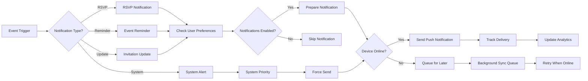
```mermaid
flowchart LR
    A[Event Trigger] --> B{Notification Type?}
    
    B -->|RSVP| C[RSVP Notification]
    B -->|Reminder| D[Event Reminder]
    B -->|Update| E[Invitation Update]
    B -->|System| F[System Alert]
    
    C --> G[Check User Preferences]
    D --> G
    E --> G
    F --> H[System Priority]
    
    G --> I{Notifications Enabled?}
    H --> J[Force Send]
    
    I -->|Yes| K[Prepare Notification]
    I -->|No| L[Skip Notification]
    
    K --> M{Device Online?}
    J --> M
    
    M -->|Yes| N[Send Push Notification]
    M -->|No| O[Queue for Later]
    
    N --> P[Track Delivery]
    O --> Q[Background Sync Queue]
    
    P --> R[Update Analytics]
    Q --> S[Retry When Online]
```

#### Template Customization Action Flow

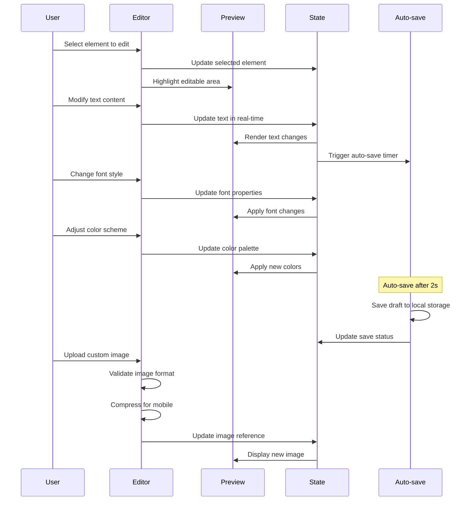
```mermaid
sequenceDiagram
    participant U as User
    participant E as Editor
    participant P as Preview
    participant S as State
    participant A as Auto-save
    
    U->>E: Select element to edit
    E->>S: Update selected element
    E->>P: Highlight editable area
    
    U->>E: Modify text content
    E->>S: Update text in real-time
    S->>P: Render text changes
    S->>A: Trigger auto-save timer
    
    U->>E: Change font style
    E->>S: Update font properties
    S->>P: Apply font changes
    
    U->>E: Adjust color scheme
    E->>S: Update color palette
    S->>P: Apply new colors
    
    Note over A: Auto-save after 2s
    A->>A: Save draft to local storage
    A->>S: Update save status
    
    U->>E: Upload custom image
    E->>E: Validate image format
    E->>E: Compress for mobile
    E->>S: Update image reference
    S->>P: Display new image
```

#### Search and Filter Action Flow

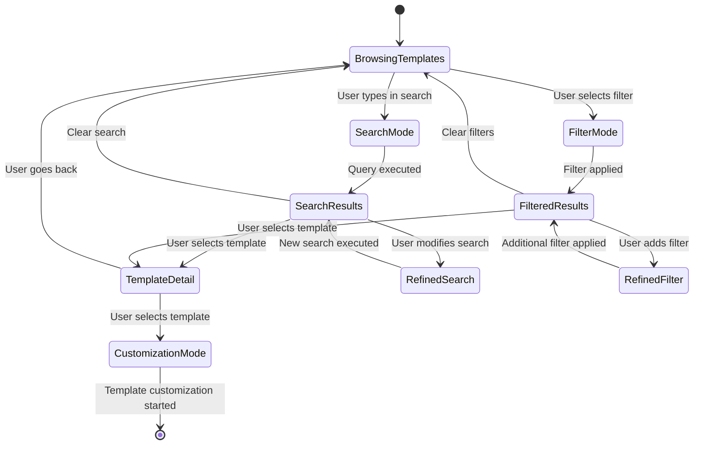
```mermaid
stateDiagram-v2
    [*] --> BrowsingTemplates
    
    BrowsingTemplates --> SearchMode : User types in search
    BrowsingTemplates --> FilterMode : User selects filter
    
    SearchMode --> SearchResults : Query executed
    FilterMode --> FilteredResults : Filter applied
    
    SearchResults --> TemplateDetail : User selects template
    FilteredResults --> TemplateDetail : User selects template
    
    SearchResults --> RefinedSearch : User modifies search
    FilteredResults --> RefinedFilter : User adds filter
    
    RefinedSearch --> SearchResults : New search executed
    RefinedFilter --> FilteredResults : Additional filter applied
    
    SearchResults --> BrowsingTemplates : Clear search
    FilteredResults --> BrowsingTemplates : Clear filters
    
    TemplateDetail --> CustomizationMode : User selects template
    TemplateDetail --> BrowsingTemplates : User goes back
    
    CustomizationMode --> [*] : Template customization started
```

#### Multi-language Support Action Flow

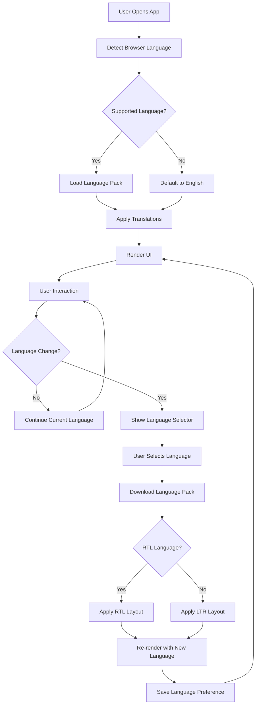
```mermaid
flowchart TD
    A[User Opens App] --> B[Detect Browser Language]
    B --> C{Supported Language?}
    
    C -->|Yes| D[Load Language Pack]
    C -->|No| E[Default to English]
    
    D --> F[Apply Translations]
    E --> F
    
    F --> G[Render UI]
    G --> H[User Interaction]
    
    H --> I{Language Change?}
    I -->|No| J[Continue Current Language]
    I -->|Yes| K[Show Language Selector]
    
    K --> L[User Selects Language]
    L --> M[Download Language Pack]
    M --> N{RTL Language?}
    
    N -->|Yes| O[Apply RTL Layout]
    N -->|No| P[Apply LTR Layout]
    
    O --> Q[Re-render with New Language]
    P --> Q
    
    Q --> R[Save Language Preference]
    R --> G
    
    J --> H
```

## Routing & Navigation

**Route Structure:**
```
/ (Home Page)
├── /create (Invitation Builder)
├── /templates (Template Gallery)
├── /invitation/:id (Guest View)
├── /rsvp/:invitationId (RSVP Form)
├── /dashboard (Couple Management)
│   ├── /dashboard/invitations
│   ├── /dashboard/guests
│   └── /dashboard/rsvp
└── /share/:id (Social Share Landing)
```

**Mobile Navigation Pattern:**
- **Top Navigation:** Logo, Profile, Settings (Mobile Hamburger)
- **Bottom Tab Bar:** Home, Create, My Invitations, Dashboard
- **Gesture Support:** Swipe navigation between sections
- **Deep Linking:** Direct links to specific invitations

**Navigation Guards:**
- Authentication required for dashboard and creation
- Guest access validation for RSVP forms
- Mobile-optimized back button behavior

## Styling Strategy

**Mobile-First Tailwind Configuration:**
```css
/* Custom breakpoints for wedding app */
module.exports = {
  screens: {
    'xs': '375px',    // Small phones
    'sm': '640px',    // Large phones
    'md': '768px',    // Tablets
    'lg': '1024px',   // Small desktops
    'xl': '1280px',   // Large desktops
  }
}
```

**Component Styling Approach:**
- **Base Styles:** Typography, colors, spacing defined in Tailwind config
- **Component Variants:** Button, card, input variations using Tailwind compose
- **Responsive Design:** Mobile-first with progressive enhancement
- **Theme System:** Wedding-specific color palettes (romantic, elegant, modern)

**Key Design Patterns:**
```css
/* Mobile-first card component */
.invitation-card {
  @apply w-full mx-auto max-w-sm sm:max-w-md md:max-w-lg;
  @apply p-4 sm:p-6 md:p-8;
  @apply shadow-sm sm:shadow-md;
  @apply rounded-lg sm:rounded-xl;
}

/* Touch-friendly buttons */
.btn-primary {
  @apply min-h-[44px] px-6 py-3;
  @apply text-base sm:text-sm;
  @apply rounded-full;
  @apply active:scale-95 transition-transform;
}
```

## State Management

**Zustand Store Architecture:**

```typescript
// Invitation Store
const useInvitationStore = create<InvitationState>((set, get) => ({
  invitations: [],
  currentInvitation: null,
  templates: [],
  
  // Actions
  createInvitation: (template: Template) => {
    const newInvitation = {
      id: generateId(),
      templateId: template.id,
      customizations: {},
      createdAt: new Date(),
      status: 'draft'
    }
    set(state => ({
      invitations: [...state.invitations, newInvitation],
      currentInvitation: newInvitation
    }))
  },
  
  updateInvitation: (id: string, updates: Partial<Invitation>) => {
    set(state => ({
      invitations: state.invitations.map(inv => 
        inv.id === id ? { ...inv, ...updates } : inv
      ),
      currentInvitation: state.currentInvitation?.id === id 
        ? { ...state.currentInvitation, ...updates }
        : state.currentInvitation
    }))
  }
}))

// Guest Management Store
const useGuestStore = create<GuestState>((set) => ({
  guests: [],
  rsvpResponses: [],
  
  addGuest: (guest: Omit<Guest, 'id'>) => {
    const newGuest = { ...guest, id: generateId() }
    set(state => ({ guests: [...state.guests, newGuest] }))
  },
  
  recordRSVP: (rsvp: RSVP) => {
    set(state => ({ 
      rsvpResponses: [...state.rsvpResponses, rsvp] 
    }))
  }
}))
```

**State Persistence:**
- Local Storage for draft invitations
- IndexedDB for offline guest data
- Cloud sync when online

## API Integration Layer

**API Client Structure:**
```typescript
// Base API client with mobile considerations
class WeddingInvitationAPI {
  private baseURL: string
  private cache: Map<string, any> = new Map()
  
  constructor() {
    this.baseURL = import.meta.env.VITE_API_URL
  }
  
  // Optimized for mobile networks
  async request<T>(endpoint: string, options: RequestOptions): Promise<T> {
    // Implement retry logic for poor mobile connections
    // Cache responses for offline access
    // Compress requests for mobile data savings
  }
  
  // Invitation APIs
  async getTemplates(): Promise<Template[]> {
    return this.request('/templates', { cache: true })
  }
  
  async saveInvitation(invitation: Invitation): Promise<Invitation> {
    return this.request('/invitations', {
      method: 'POST',
      body: invitation,
      optimistic: true // Update UI immediately
    })
  }
  
  async submitRSVP(rsvp: RSVP): Promise<void> {
    return this.request('/rsvp', {
      method: 'POST',
      body: rsvp,
      retry: 3 // Important for guest responses
    })
  }
}
```

**Offline Strategy:**
- Service Worker for template caching
- Background sync for RSVP submissions
- Progressive data loading
- Optimistic UI updates

## Testing Strategy

**Unit Testing (Jest + React Testing Library):**
```typescript
// Component testing focused on mobile interactions
describe('InvitationCard', () => {
  it('should be touch-friendly on mobile', () => {
    render(<InvitationCard invitation={mockInvitation} />)
    const button = screen.getByRole('button', { name: /edit/i })
    expect(button).toHaveStyle('min-height: 44px') // iOS minimum touch target
  })
  
  it('should handle swipe gestures', async () => {
    const onSwipe = jest.fn()
    render(<InvitationCard onSwipe={onSwipe} />)
    
    // Simulate touch events
    await user.pointer([
      { keys: '[TouchA>]', target: screen.getByTestId('card') },
      { pointerName: 'TouchA', coords: { x: 100, y: 0 } },
      { keys: '[/TouchA]' }
    ])
    
    expect(onSwipe).toHaveBeenCalledWith('right')
  })
})
```

**Mobile-Specific Testing:**
- Touch interaction testing
- Responsive design validation
- Performance testing on mobile devices
- Offline functionality testing
- PWA installation testing

**E2E Testing (Playwright):**
```typescript
test('mobile invitation creation flow', async ({ page }) => {
  // Set mobile viewport
  await page.setViewportSize({ width: 375, height: 667 })
  
  await page.goto('/')
  await page.tap('[data-testid="create-invitation"]')
  await page.tap('[data-testid="template-romantic"]')
  
  // Test mobile-specific interactions
  await page.fill('[data-testid="couple-names"]', 'John & Jane')
  await page.tap('[data-testid="save-invitation"]')
  
  await expect(page.locator('[data-testid="success-message"]')).toBeVisible()
})
```

**Accessibility Testing:**
- Screen reader compatibility
- Touch target size validation
- Color contrast checking
- Keyboard navigation (for tablet users)

## Data Models

**Core Data Structures:**

```typescript
interface Invitation {
  id: string
  templateId: string
  coupleNames: {
    partner1: string
    partner2: string
  }
  eventDetails: {
    date: Date
    time: string
    venue: {
      name: string
      address: string
      coordinates?: [number, number]
    }
  }
  customizations: {
    colors: ColorScheme
    fonts: FontScheme
    backgroundImage?: string
    customText?: string
  }
  privacy: {
    isPublic: boolean
    requiresPassword: boolean
    password?: string
  }
  status: 'draft' | 'published' | 'archived'
  createdAt: Date
  updatedAt: Date
}

interface Guest {
  id: string
  invitationId: string
  name: string
  email?: string
  phone?: string
  plusOne: boolean
  group?: string // Family, Friends, Colleagues
  invitationSent: boolean
  invitationViewed: boolean
  createdAt: Date
}

interface RSVP {
  id: string
  invitationId: string
  guestId: string
  attending: boolean
  guestCount: number
  mealPreference?: 'vegetarian' | 'vegan' | 'meat' | 'allergies'
  specialRequests?: string
  submittedAt: Date
}

interface Template {
  id: string
  name: string
  category: 'romantic' | 'elegant' | 'modern' | 'rustic' | 'minimalist'
  preview: string
  isMobileFriendly: boolean
  customizableElements: string[]
  colorSchemes: ColorScheme[]
}
```

## Mobile-First Architecture Considerations

**Performance Optimizations:**
- Image lazy loading with WebP format
- Component code splitting
- Critical CSS inlining
- Service Worker caching
- Bundle size optimization (< 200KB initial load)

**User Experience Patterns:**
- Touch-first interactions (44px minimum touch targets)
- Swipe gestures for navigation
- Pull-to-refresh functionality
- Progressive disclosure of features
- Thumb-zone navigation placement

**Responsive Breakpoints:**
```typescript
const breakpoints = {
  mobile: '320px-767px',    // Primary focus
  tablet: '768px-1023px',   // Secondary optimization
  desktop: '1024px+',       // Enhancement layer
}
```

**Mobile-Specific Features:**
- Add to Home Screen (PWA)
- Camera integration for photo uploads
- Contact sharing for guest import
- Offline viewing of created invitations
- Push notifications for RSVP updates

## Feature Implementation Strategy

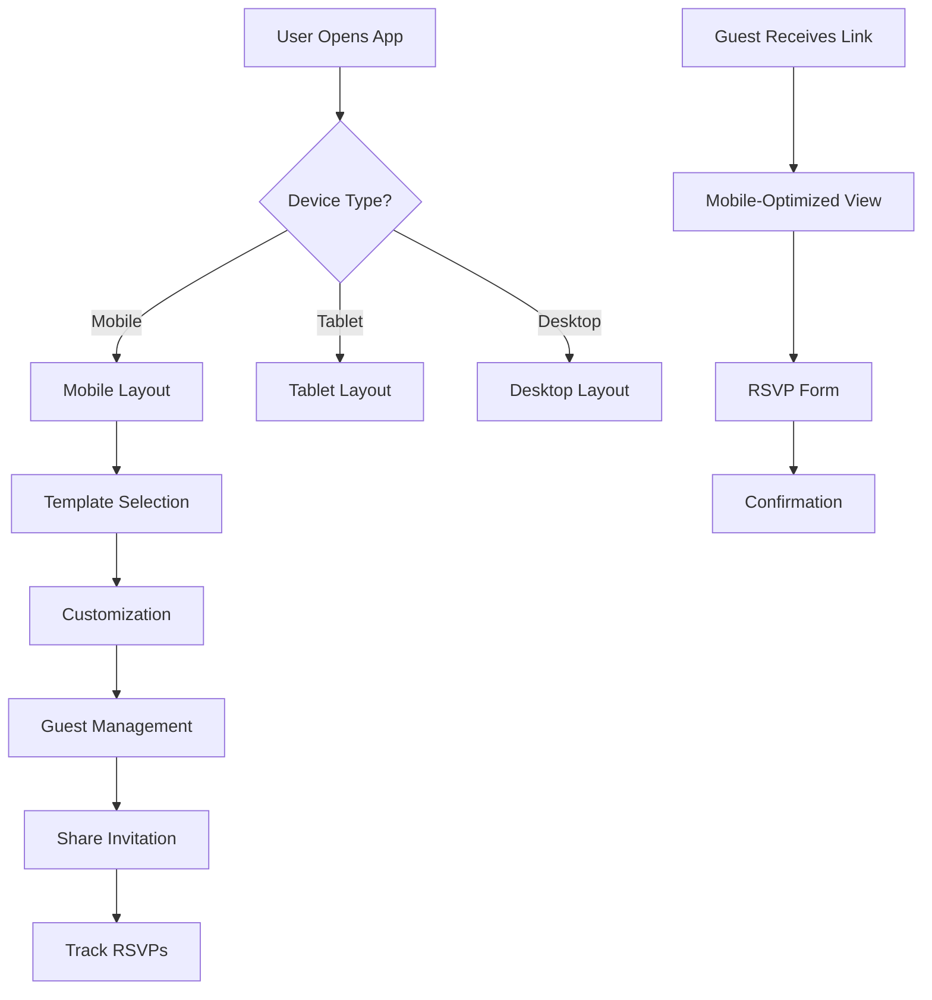
```mermaid
graph TD
    A[User Opens App] --> B{Device Type?}
    B -->|Mobile| C[Mobile Layout]
    B -->|Tablet| D[Tablet Layout]
    B -->|Desktop| E[Desktop Layout]
    
    C --> F[Template Selection]
    F --> G[Customization]
    G --> H[Guest Management]
    H --> I[Share Invitation]
    I --> J[Track RSVPs]
    
    K[Guest Receives Link] --> L[Mobile-Optimized View]
    L --> M[RSVP Form]
    M --> N[Confirmation]
```

**Progressive Enhancement Strategy:**
1. **Core Experience (Mobile):** Template selection, basic customization, RSVP
2. **Enhanced Experience (Tablet):** Advanced editing, guest management
3. **Full Experience (Desktop):** Bulk operations, analytics dashboard

This design prioritizes mobile users while providing enhanced functionality for larger screens, ensuring an optimal wedding invitation experience across all devices.

## User Experience Flows

### Primary User Journey - Couple Creating Invitation

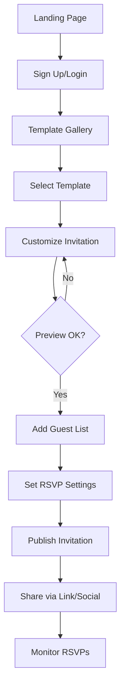
```mermaid
flowchart TD
    A[Landing Page] --> B[Sign Up/Login]
    B --> C[Template Gallery]
    C --> D[Select Template]
    D --> E[Customize Invitation]
    E --> F{Preview OK?}
    F -->|No| E
    F -->|Yes| G[Add Guest List]
    G --> H[Set RSVP Settings]
    H --> I[Publish Invitation]
    I --> J[Share via Link/Social]
    J --> K[Monitor RSVPs]
```

### Detailed Mobile User Flows

#### Template Selection Flow (Mobile-Optimized)

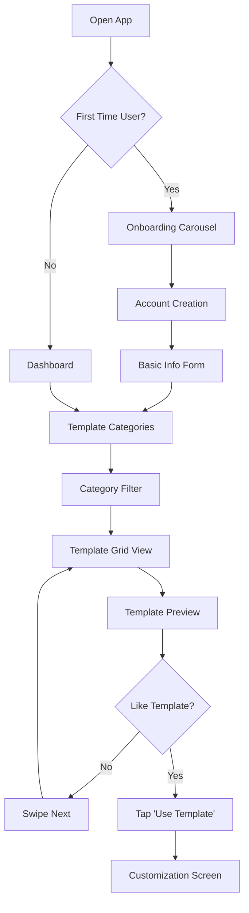
```mermaid
flowchart TD
    A[Open App] --> B{First Time User?}
    B -->|Yes| C[Onboarding Carousel]
    B -->|No| D[Dashboard]
    C --> E[Account Creation]
    E --> F[Basic Info Form]
    F --> G[Template Categories]
    
    D --> G
    G --> H[Category Filter]
    H --> I[Template Grid View]
    I --> J[Template Preview]
    J --> K{Like Template?}
    K -->|No| L[Swipe Next]
    L --> I
    K -->|Yes| M[Tap 'Use Template']
    M --> N[Customization Screen]
```

#### Mobile Customization Workflow

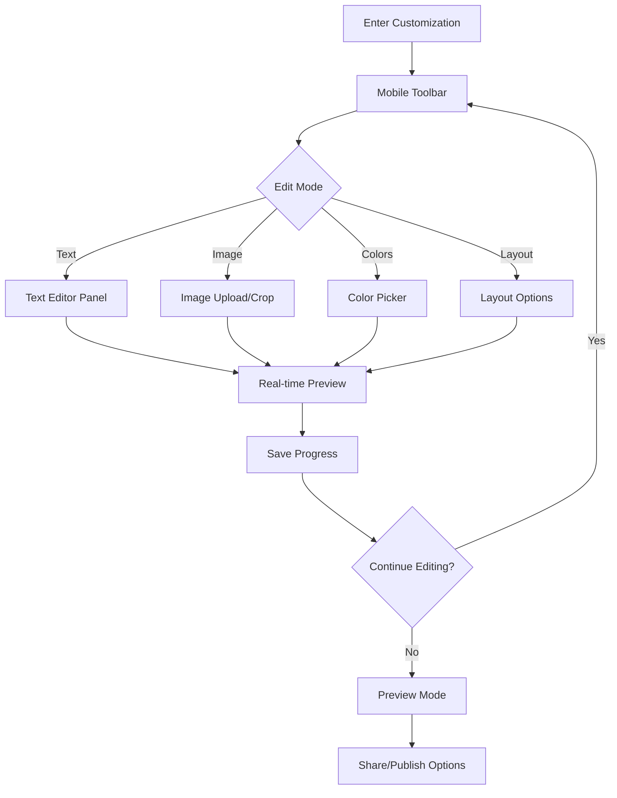
```mermaid
flowchart TD
    A[Enter Customization] --> B[Mobile Toolbar]
    B --> C{Edit Mode}
    C -->|Text| D[Text Editor Panel]
    C -->|Image| E[Image Upload/Crop]
    C -->|Colors| F[Color Picker]
    C -->|Layout| G[Layout Options]
    
    D --> H[Real-time Preview]
    E --> H
    F --> H
    G --> H
    
    H --> I[Save Progress]
    I --> J{Continue Editing?}
    J -->|Yes| B
    J -->|No| K[Preview Mode]
    K --> L[Share/Publish Options]
```

#### Guest Management Flow (Mobile-First)

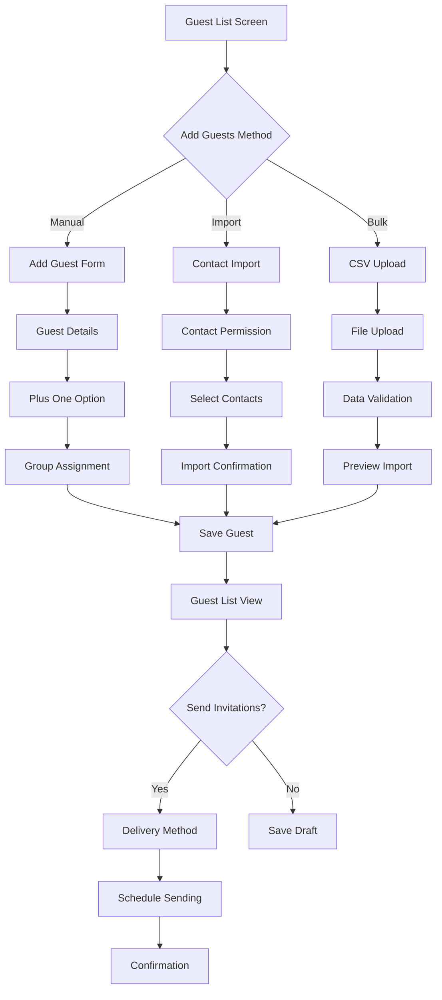
```mermaid
flowchart TD
    A[Guest List Screen] --> B{Add Guests Method}
    B -->|Manual| C[Add Guest Form]
    B -->|Import| D[Contact Import]
    B -->|Bulk| E[CSV Upload]
    
    C --> F[Guest Details]
    F --> G[Plus One Option]
    G --> H[Group Assignment]
    H --> I[Save Guest]
    
    D --> J[Contact Permission]
    J --> K[Select Contacts]
    K --> L[Import Confirmation]
    L --> I
    
    E --> M[File Upload]
    M --> N[Data Validation]
    N --> O[Preview Import]
    O --> I
    
    I --> P[Guest List View]
    P --> Q{Send Invitations?}
    Q -->|Yes| R[Delivery Method]
    Q -->|No| S[Save Draft]
    
    R --> T[Schedule Sending]
    T --> U[Confirmation]
```

### Guest Experience Journey

```mermaid
flowchart TD
    A[Receive Invitation Link] --> B[Loading Screen]
    B --> C{Network Available?}
    C -->|No| D[Offline Mode]
    C -->|Yes| E[Load Invitation]
    
    D --> F[Cached Invitation]
    F --> G[Basic View Only]
    
    E --> H[Full Invitation View]
    H --> I[Scroll Through Details]
    I --> J[Event Information]
    J --> K[Venue Map]
    K --> L[RSVP Section]
    L --> M{Want to RSVP?}
    M -->|No| N[Share Invitation]
    M -->|Yes| O[RSVP Form]
    
    O --> P[Attendance Choice]
    P --> Q{Attending?}
    Q -->|Yes| R[Guest Count]
    Q -->|No| S[Decline Message]
    
    R --> T[Meal Preferences]
    T --> U[Special Requests]
    U --> V[Contact Info]
    V --> W[Submit RSVP]
    
    S --> W
    W --> X[Confirmation Screen]
    X --> Y[Add to Calendar]
    Y --> Z[Thank You Message]
```

### Error Handling & Edge Cases

#### Network Connectivity Issues

```mermaid
flowchart TD
    A[User Action] --> B{Network Check}
    B -->|Connected| C[Process Request]
    B -->|Disconnected| D[Queue Action]
    
    C --> E{Request Success?}
    E -->|Yes| F[Update UI]
    E -->|No| G[Retry Logic]
    
    D --> H[Show Offline Banner]
    H --> I[Store in Local Storage]
    I --> J[Background Sync Queue]
    
    G --> K{Retry Count < 3?}
    K -->|Yes| L[Exponential Backoff]
    K -->|No| M[Show Error Message]
    
    L --> C
    M --> N[Offer Manual Retry]
    
    J --> O{Network Restored?}
    O -->|Yes| P[Process Queue]
    O -->|No| Q[Continue Offline]
    
    P --> C
```

#### Form Validation Flow

```mermaid
flowchart TD
    A[User Input] --> B[Real-time Validation]
    B --> C{Valid Input?}
    C -->|Yes| D[Green Check Icon]
    C -->|No| E[Inline Error Message]
    
    E --> F[Suggest Correction]
    F --> G[Auto-fix Option]
    G --> H{Accept Auto-fix?}
    H -->|Yes| I[Apply Correction]
    H -->|No| J[Manual Correction]
    
    I --> D
    J --> A
    
    D --> K[Enable Submit Button]
    K --> L[Form Submission]
    L --> M{Server Validation?}
    M -->|Pass| N[Success Response]
    M -->|Fail| O[Server Error Display]
    
    O --> P[Highlight Problem Fields]
    P --> A
```

### Mobile-Specific Interaction Patterns

**Gesture Controls:**
- **Swipe Left/Right:** Navigate between invitation templates
- **Pinch to Zoom:** Preview invitation details (max 3x zoom)
- **Pull to Refresh:** Update RSVP responses
- **Long Press:** Context menu for guest management (edit, delete, resend)
- **Double Tap:** Quick like/favorite template
- **Swipe Up:** Reveal additional options panel

**Touch Interactions:**
- **Tap Zones:** All interactive elements minimum 44px height
- **Thumb Reach:** Primary actions within bottom 2/3 of screen
- **Edge Swipe:** Navigate back (iOS-style)
- **Floating Action Button:** Quick create invitation (bottom right)

**Haptic Feedback:**
```typescript
const hapticPatterns = {
  selection: 'light', // Template selection
  success: 'medium',  // RSVP submission
  error: 'heavy',     // Form validation error
  longPress: 'medium' // Context menu activation
}
```

## Security & Privacy Architecture

### Data Protection

```typescript
interface SecurityConfig {
  // Guest data encryption
  guestDataEncryption: 'AES-256'
  
  // Invitation privacy levels
  privacyLevels: {
    public: 'Searchable and shareable'
    private: 'Direct link access only'
    protected: 'Password required'
  }
  
  // RSVP data handling
  rsvpDataRetention: '2 years post-event'
  dataExportOptions: ['CSV', 'PDF', 'JSON']
}
```

### Authentication Strategy

**Guest Access:**
- No account required for viewing invitations
- Optional guest registration for RSVP tracking
- Magic link authentication for return visits

**Couple Authentication:**
- Email/password or social login (Google, Facebook)
- Two-factor authentication for premium accounts
- Session management with automatic logout

## Content Management System

### Template Architecture & Management

```typescript
interface TemplateSystem {
  categories: {
    romantic: {
      templates: Template[]
      characteristics: ['soft colors', 'floral elements', 'script fonts']
      mobileOptimization: 'portrait-first layout'
    }
    elegant: {
      templates: Template[]
      characteristics: ['gold accents', 'serif fonts', 'minimal design']
      mobileOptimization: 'clean typography focus'
    }
    modern: {
      templates: Template[]
      characteristics: ['bold colors', 'geometric shapes', 'sans-serif']
      mobileOptimization: 'touch-friendly buttons'
    }
    rustic: {
      templates: Template[]
      characteristics: ['earth tones', 'wood textures', 'handwritten fonts']
      mobileOptimization: 'high contrast for readability'
    }
    minimalist: {
      templates: Template[]
      characteristics: ['white space', 'single accent color', 'clean lines']
      mobileOptimization: 'fast loading, simple layout'
    }
    cultural: {
      indian: Template[] // Mandala patterns, vibrant colors
      jewish: Template[] // Hebrew text support, traditional symbols
      chinese: Template[] // Red/gold themes, double happiness symbol
      muslim: Template[] // Geometric patterns, Arabic calligraphy
    }
  }
  
  customizationLevels: {
    basic: {
      options: ['colors', 'fonts', 'text', 'couple names']
      mobileInterface: 'simple tap-to-edit'
      complexity: 'beginner-friendly'
    }
    advanced: {
      options: ['layout', 'animations', 'custom_css', 'background_patterns']
      mobileInterface: 'drawer-based editor'
      complexity: 'intermediate users'
    }
    premium: {
      options: ['video_backgrounds', 'music', 'interactive_elements', 'custom_animations']
      mobileInterface: 'full-screen editor'
      complexity: 'power users'
    }
  }
}
```

### Template Data Structure

```typescript
interface Template {
  id: string
  name: string
  category: TemplateCategory
  subcategory?: string
  
  // Mobile-specific properties
  mobileLayout: {
    aspectRatio: '9:16' | '3:4' | 'auto'
    scrollBehavior: 'vertical' | 'paginated'
    touchTargets: TouchTarget[]
    gestureSupport: GestureType[]
  }
  
  // Visual properties
  preview: {
    thumbnail: string // Mobile-optimized preview
    fullPreview: string
    animatedPreview?: string // GIF for mobile
  }
  
  // Content structure
  sections: {
    header: TemplateSection
    coupleNames: TemplateSection
    eventDetails: TemplateSection
    venue: TemplateSection
    rsvp: TemplateSection
    footer: TemplateSection
    custom?: TemplateSection[]
  }
  
  // Customization options
  customizable: {
    colors: ColorPalette[]
    fonts: FontFamily[]
    layouts: LayoutVariant[]
    animations: AnimationPreset[]
  }
  
  // Performance metrics
  performance: {
    loadTime: number // Target load time in ms
    bundleSize: number // Template asset size in KB
    mobileScore: number // Mobile usability score 1-100
  }
  
  // Metadata
  tags: string[]
  popularity: number
  createdAt: Date
  updatedAt: Date
  isActive: boolean
  isMobileFriendly: boolean
}
```

### Mobile-First Template Editor

```typescript
interface MobileTemplateEditor {
  // Touch-optimized editing interface
  editingModes: {
    quickEdit: {
      description: 'Tap-to-edit text and images'
      interface: 'inline editing with mobile keyboard'
      tools: ['text', 'image', 'color']
    }
    
    advancedEdit: {
      description: 'Slide-up panel with full options'
      interface: 'bottom sheet with tool categories'
      tools: ['layout', 'fonts', 'animations', 'effects']
    }
    
    previewMode: {
      description: 'Full-screen invitation preview'
      interface: 'swipe between different screen sizes'
      tools: ['share', 'save', 'publish']
    }
  }
  
  // Mobile editing tools
  tools: {
    textEditor: {
      mobilekeyboard: 'optimized for wedding terminology'
      autoSuggestions: ['ceremony', 'reception', 'celebration']
      voiceInput: 'speech-to-text for names and addresses'
    }
    
    imageEditor: {
      cropTool: 'pinch and drag crop interface'
      filters: 'instagram-style filter selection'
      upload: 'camera integration and photo library access'
    }
    
    colorPicker: {
      interface: 'color wheel with haptic feedback'
      presets: 'wedding color scheme suggestions'
      accessibility: 'color contrast validation'
    }
  }
}
```

### Content Workflow Management

```mermaid
flowchart TD
    A[Template Creation] --> B[Mobile Design Review]
    B --> C{Mobile Score > 80?}
    C -->|No| D[Mobile Optimization]
    C -->|Yes| E[Content Approval]
    
    D --> F[Adjust Layout]
    F --> G[Optimize Images]
    G --> H[Test Touch Targets]
    H --> I[Performance Testing]
    I --> B
    
    E --> J[A/B Testing]
    J --> K[User Feedback Collection]
    K --> L{Performance Acceptable?}
    L -->|Yes| M[Publish to Gallery]
    L -->|No| N[Template Refinement]
    
    N --> D
    M --> O[Monitor Usage Analytics]
    O --> P[Template Optimization]
    P --> Q[Version Update]
```

### Dynamic Content Personalization

```typescript
interface ContentPersonalization {
  // AI-driven content suggestions
  smartSuggestions: {
    textContent: {
      weddingStyle: 'formal' | 'casual' | 'rustic' | 'modern'
      toneOfVoice: 'traditional' | 'playful' | 'romantic' | 'elegant'
      culturalContext: 'western' | 'indian' | 'chinese' | 'jewish' | 'muslim'
    }
    
    visualElements: {
      seasonalThemes: 'spring' | 'summer' | 'fall' | 'winter'
      locationBased: 'beach' | 'garden' | 'church' | 'outdoor' | 'venue'
      timeOfDay: 'morning' | 'afternoon' | 'evening' | 'night'
    }
  }
  
  // Mobile-optimized content delivery
  adaptiveContent: {
    imageOptimization: {
      devicePixelRatio: 'auto-detect and serve appropriate resolution'
      formatSelection: 'WebP for modern browsers, JPEG fallback'
      lazyLoading: 'intersection observer for mobile performance'
    }
    
    textOptimization: {
      fontLoading: 'progressive font loading with system fallbacks'
      textScaling: 'responsive typography based on screen size'
      readability: 'optimal line height and spacing for mobile'
    }
  }
}
```

### Content Delivery Network Architecture

```typescript
interface CDNStrategy {
  // Global content distribution
  edgeLocations: {
    americas: ['US-East', 'US-West', 'Brazil', 'Canada']
    europe: ['UK', 'Germany', 'France', 'Netherlands']
    asiaPacific: ['Singapore', 'Japan', 'Australia', 'India']
  }
  
  // Mobile-optimized caching
  cachingRules: {
    templates: {
      ttl: '30 days'
      strategy: 'cache-first with background update'
      mobileOptimization: 'separate cache for mobile variants'
    }
    
    images: {
      ttl: '7 days'
      strategy: 'stale-while-revalidate'
      compression: 'aggressive compression for mobile'
    }
    
    fonts: {
      ttl: '90 days'
      strategy: 'immutable caching'
      preload: 'critical fonts for mobile performance'
    }
  }
  
  // Performance monitoring
  metrics: {
    mobileLoadTimes: 'track LCP, FID, CLS by device type'
    geographicPerformance: 'monitor performance by region'
    errorRates: 'track 404s and failed requests'
  }
}
```

### Template Version Control

```typescript
interface TemplateVersioning {
  // Version management
  versions: {
    major: 'breaking changes (layout restructure)'
    minor: 'new features (new customization options)'
    patch: 'bug fixes and optimizations'
  }
  
  // Mobile compatibility tracking
  compatibilityMatrix: {
    ios: {
      safari: 'version compatibility range'
      chrome: 'version compatibility range'
      firefox: 'version compatibility range'
    }
    android: {
      chrome: 'version compatibility range'
      samsung: 'Samsung Internet compatibility'
      firefox: 'version compatibility range'
    }
  }
  
  // Rollback strategy
  deployment: {
    canaryRelease: '5% of mobile users'
    gradualRollout: '25%, 50%, 100% over 3 days'
    rollbackTrigger: 'error rate > 1% or performance degradation > 10%'
  }
}
```

## Performance Optimization Strategy

### Mobile Performance Targets & Metrics

```typescript
const performanceMetrics = {
  // Core Web Vitals for mobile (Google's standards)
  coreWebVitals: {
    LCP: {
      target: '< 2.5s', // Largest Contentful Paint
      measurement: 'Hero invitation image load time'
      optimization: 'Image compression + CDN'
    },
    FID: {
      target: '< 100ms', // First Input Delay
      measurement: 'Time from tap to response'
      optimization: 'Code splitting + main thread optimization'
    },
    CLS: {
      target: '< 0.1', // Cumulative Layout Shift
      measurement: 'Layout stability during load'
      optimization: 'Reserve space for images + fonts'
    }
  },
  
  // Mobile-specific performance metrics
  mobileMetrics: {
    TTI: {
      target: '< 3s', // Time to Interactive
      measurement: 'When user can interact with invitation'
      critical: 'Essential for mobile user retention'
    },
    FCP: {
      target: '< 1.8s', // First Contentful Paint
      measurement: 'First text/image appears'
      optimization: 'Critical CSS inlining'
    },
    SI: {
      target: '< 3s', // Speed Index
      measurement: 'Visual completeness over time'
      tools: 'Lighthouse mobile audit'
    }
  },
  
  // Bundle size constraints
  bundleOptimization: {
    initialBundle: '< 200KB', // Critical path
    totalBundle: '< 1MB', // Full application
    chunkSizes: {
      vendor: '< 150KB',
      main: '< 100KB',
      templates: '< 50KB per template'
    }
  }
}
```

### Advanced Caching & Storage Strategy

```typescript
const advancedCachingStrategy = {
  // Service Worker caching layers
  serviceWorkerCache: {
    // Critical resources (always cached)
    critical: {
      resources: ['app-shell', 'critical-css', 'essential-js'],
      strategy: 'Cache First',
      maxAge: '30 days',
      fallback: 'offline.html'
    },
    
    // Templates (large assets)
    templates: {
      resources: ['template-previews', 'template-assets'],
      strategy: 'Stale While Revalidate',
      maxAge: '7 days',
      compression: 'gzip + brotli',
      conditionalCaching: 'based on user preferences'
    },
    
    // User data (frequently updated)
    userData: {
      resources: ['invitations', 'guest-lists', 'rsvp-data'],
      strategy: 'Network First',
      maxAge: '1 hour',
      backgroundSync: true,
      conflictResolution: 'last-write-wins'
    },
    
    // Images (content-heavy)
    images: {
      resources: ['invitation-images', 'template-backgrounds'],
      strategy: 'Cache First',
      maxAge: '14 days',
      sizeLimit: '50MB total cache',
      evictionPolicy: 'LRU (Least Recently Used)'
    }
  },
  
  // Browser storage utilization
  browserStorage: {
    localStorage: {
      usage: 'User preferences, theme settings',
      maxSize: '5MB',
      dataTypes: ['user-settings', 'recent-templates', 'draft-invitations']
    },
    
    sessionStorage: {
      usage: 'Current session data, form state',
      maxSize: '5MB',
      dataTypes: ['form-progress', 'temp-uploads', 'navigation-state']
    },
    
    indexedDB: {
      usage: 'Offline guest data, large templates',
      maxSize: '50MB',
      tables: ['guests', 'templates', 'invitations', 'media'],
      syncStrategy: 'background sync when online'
    }
  }
}
```

### Mobile Network Optimization

```typescript
interface NetworkOptimization {
  // Adaptive loading based on connection
  connectionAwareLoading: {
    '4g': {
      strategy: 'full quality images and templates',
      preload: 'next 3 templates in category',
      backgroundTasks: 'prefetch popular templates'
    },
    '3g': {
      strategy: 'compressed images, lazy load templates',
      preload: 'next 1 template only',
      backgroundTasks: 'minimal prefetching'
    },
    '2g': {
      strategy: 'ultra-compressed images, text-only mode',
      preload: 'disabled',
      backgroundTasks: 'disabled',
      fallback: 'offline-first experience'
    },
    'offline': {
      strategy: 'serve cached content only',
      features: ['view saved invitations', 'draft editing'],
      limitations: ['no template browsing', 'no sharing']
    }
  },
  
  // Progressive image loading
  imageOptimization: {
    responsiveImages: {
      breakpoints: {
        mobile: '320w, 640w, 960w',
        tablet: '768w, 1536w',
        desktop: '1024w, 2048w'
      },
      formats: {
        modern: 'WebP, AVIF',
        fallback: 'JPEG, PNG',
        sizes: 'auto-calculated based on container'
      }
    },
    
    loadingStrategy: {
      critical: 'eager load (above fold)',
      important: 'lazy load with low threshold (200px)',
      background: 'lazy load with high threshold (1000px)',
      decorative: 'load on interaction'
    },
    
    compressionLevels: {
      hero: 'quality: 90, progressive: true',
      content: 'quality: 80, progressive: true',
      thumbnails: 'quality: 70, progressive: false',
      background: 'quality: 60, blur placeholder'
    }
  }
}
```

### Code Splitting & Bundle Optimization

```typescript
const bundleOptimization = {
  // Route-based code splitting
  routeSplitting: {
    home: {
      chunks: ['home-page', 'template-gallery'],
      size: '< 50KB',
      preload: 'template-creation on user intent'
    },
    
    editor: {
      chunks: ['editor-core', 'customization-tools'],
      size: '< 80KB',
      dynamicImports: ['advanced-tools', 'premium-features']
    },
    
    viewer: {
      chunks: ['invitation-viewer', 'rsvp-form'],
      size: '< 40KB', // Optimized for guests
      critical: 'fastest loading for guest experience'
    }
  },
  
  // Component-level splitting
  componentSplitting: {
    templateGallery: {
      strategy: 'virtual scrolling + dynamic imports',
      chunkSize: '10 templates per chunk',
      preloading: 'intersection observer'
    },
    
    customizationPanel: {
      strategy: 'lazy load tools on interaction',
      modules: ['color-picker', 'font-selector', 'layout-editor'],
      loading: 'shimmer placeholder'
    },
    
    premiumFeatures: {
      strategy: 'conditional loading based on subscription',
      modules: ['video-backgrounds', 'music-player', 'animations'],
      fallback: 'upgrade prompts for free users'
    }
  },
  
  // Third-party library optimization
  vendorOptimization: {
    reactBundle: {
      production: 'minified React production build',
      treeshaking: 'remove unused React features',
      splitting: 'separate vendor chunk'
    },
    
    utilities: {
      lodash: 'import specific functions only',
      momentjs: 'replace with date-fns for smaller bundle',
      icons: 'tree-shake unused icons'
    },
    
    polyfills: {
      strategy: 'conditional loading based on browser support',
      modernBrowsers: 'no polyfills needed',
      legacyBrowsers: 'load polyfills dynamically'
    }
  }
}
```

### Real-time Performance Monitoring

```typescript
interface PerformanceMonitoring {
  // User-centric metrics collection
  realUserMonitoring: {
    collection: {
      coreWebVitals: 'automatic via Performance Observer API',
      customMetrics: 'template load times, RSVP submission times',
      userExperience: 'rage clicks, error boundaries, abandonment'
    },
    
    segmentation: {
      deviceType: 'mobile, tablet, desktop',
      networkType: '4g, 3g, 2g, offline',
      geographic: 'region-based performance analysis',
      userType: 'couples vs guests, new vs returning'
    },
    
    alerting: {
      thresholds: {
        LCP: 'alert if > 3s for > 5% of users',
        FID: 'alert if > 200ms for > 1% of users',
        errorRate: 'alert if > 0.5% of requests fail'
      },
      channels: ['Slack', 'email', 'PagerDuty for critical issues']
    }
  },
  
  // Performance budgets
  budgetEnforcement: {
    buildTime: {
      bundleSize: 'fail build if main bundle > 200KB',
      imageOptimization: 'warn if images not optimized',
      duplicateDependencies: 'fail if duplicate packages detected'
    },
    
    runtime: {
      memoryUsage: 'alert if heap size > 100MB on mobile',
      cpuUsage: 'monitor main thread blocking > 50ms',
      networkRequests: 'limit concurrent requests to 6'
    }
  }
}
```

### Mobile-Specific Optimizations

```typescript
const advancedMobileOptimizations = {
  // Enhanced touch and gesture optimizations
  touchOptimization: {
    targets: {
      minimum: '44px x 44px', // WCAG AAA compliance
      comfortable: '48px x 48px', // Material Design recommendation
      spacing: '8px minimum between adjacent targets',
      hitArea: 'extend beyond visual bounds for easier tapping'
    },
    
    feedback: {
      visual: {
        pressed: 'background color change + scale transform',
        loading: 'spinner overlay with opacity transition',
        success: 'checkmark animation + green highlight',
        error: 'shake animation + red highlight'
      },
      
      haptic: {
        lightTap: 'button presses, toggle switches',
        mediumTap: 'form submissions, confirmations',
        heavyTap: 'errors, destructive actions',
        selection: 'list item selection, template choice'
      },
      
      audio: {
        success: 'subtle chime for RSVP submission',
        error: 'gentle alert tone for validation errors',
        navigation: 'soft click for menu transitions'
      }
    },
    
    gestures: {
      swipe: {
        templateNavigation: {
          direction: 'horizontal (left/right)',
          threshold: '50px minimum swipe distance',
          velocity: '0.3px/ms minimum for intent detection',
          animation: 'smooth slide transition with easing'
        },
        
        pageNavigation: {
          direction: 'vertical (up/down)',
          zones: 'edge swipe detection for back navigation',
          conflicts: 'distinguish from scroll gestures'
        }
      },
      
      pinch: {
        zoomLimits: 'min: 0.5x, max: 3x',
        centerPoint: 'maintain focus on pinch center',
        smoothing: 'momentum-based zoom with deceleration',
        boundaries: 'elastic bounce at zoom limits'
      },
      
      longPress: {
        duration: '500ms for context menus',
        preview: '300ms for peek/pop interactions',
        feedback: 'haptic pulse at activation threshold'
      }
    }
  },
  
  // Advanced scrolling and navigation
  scrollingOptimization: {
    performance: {
      momentum: 'native -webkit-overflow-scrolling: touch',
      deceleration: 'custom easing curves for natural feel',
      snapPoints: 'CSS scroll-snap for template galleries',
      virtualizing: 'react-window for guest lists > 100 items'
    },
    
    interactions: {
      pullToRefresh: {
        threshold: '80px pull distance',
        animation: 'loading spinner with progress indication',
        feedback: 'haptic pulse when threshold reached',
        implementation: 'custom hook with gesture detection'
      },
      
      infiniteScroll: {
        trigger: '200px from bottom',
        batchSize: '20 items per load',
        skeleton: 'placeholder cards during loading',
        errorHandling: 'retry button with exponential backoff'
      },
      
      overscroll: {
        behavior: 'elastic bounce effect',
        customization: 'wedding-themed bounce animations',
        boundaries: 'visual indicators at scroll limits'
      }
    }
  },
  
  // Mobile hardware integration
  hardwareIntegration: {
    camera: {
      photoCapture: {
        constraints: {
          width: { ideal: 1920 },
          height: { ideal: 1080 },
          aspectRatio: { ideal: 16/9 },
          facingMode: 'user' // Front camera for couple photos
        },
        
        processing: {
          compression: 'client-side JPEG compression to 80% quality',
          resizing: 'canvas-based resizing to target dimensions',
          cropping: 'touch-based crop interface with guides',
          filters: 'real-time Instagram-style filters'
        }
      },
      
      permissions: {
        request: 'contextual permission requests with explanation',
        fallback: 'file upload option if camera denied',
        privacy: 'clear data usage and storage policies'
      }
    },
    
    geolocation: {
      venueDetection: {
        accuracy: 'high accuracy for venue suggestions',
        caching: 'cache coordinates to reduce battery drain',
        fallback: 'manual address entry if location denied'
      },
      
      guestDirections: {
        integration: 'deep links to maps apps',
        options: ['Google Maps', 'Apple Maps', 'Waze'],
        offline: 'cached venue coordinates for offline access'
      }
    },
    
    contacts: {
      import: {
        permissions: 'request with clear benefit explanation',
        filtering: 'smart filtering for wedding-relevant contacts',
        matching: 'fuzzy matching for duplicate detection',
        privacy: 'contacts never stored on servers'
      },
      
      sharing: {
        nativeShare: 'iOS/Android native share sheets',
        deepLinks: 'custom app links for invitation sharing',
        fallback: 'web-based sharing for unsupported platforms'
      }
    }
  },
  
  // Battery and resource management
  resourceOptimization: {
    backgroundBehavior: {
      appStates: {
        active: 'full functionality, real-time updates',
        background: 'pause animations, reduce network requests',
        suspended: 'minimal background sync only'
      },
      
      dataSync: {
        strategy: 'batch sync when app becomes active',
        conflicts: 'merge strategies for concurrent edits',
        offline: 'queue operations for background sync'
      }
    },
    
    memoryManagement: {
      imageHandling: {
        caching: 'intelligent LRU cache with size limits',
        compression: 'WebP with JPEG fallback',
        lazy: 'intersection observer for off-screen images',
        cleanup: 'garbage collection of unused images'
      },
      
      componentOptimization: {
        virtualization: 'virtual scrolling for large lists',
        memoization: 'React.memo for expensive components',
        cleanup: 'proper cleanup of event listeners and timers'
      }
    },
    
    networkOptimization: {
      adaptiveLoading: {
        connectionAware: 'detect slow connections and adapt',
        preloading: 'intelligent preloading based on user behavior',
        prioritization: 'critical resources loaded first'
      },
      
      requestOptimization: {
        batching: 'combine multiple API calls',
        debouncing: 'debounce search and real-time inputs',
        caching: 'aggressive caching with smart invalidation'
      }
    }
  }
}
```

### Progressive Web App Mobile Features

```typescript
const mobilePWAFeatures = {
  installation: {
    installPrompt: {
      timing: 'after user creates first invitation',
      dismissal: 'remember dismissal for 30 days',
      customUI: 'branded install banner with wedding imagery',
      fallback: 'manual install instructions for all browsers'
    },
    
    homeScreen: {
      icons: {
        sizes: '72x72, 96x96, 128x128, 144x144, 152x152, 192x192, 384x384, 512x512',
        maskable: 'adaptive icons for Android 8+',
        purpose: 'any maskable for broader compatibility'
      },
      
      shortcuts: [
        {
          name: 'Create Invitation',
          url: '/create',
          icon: 'create-icon.png'
        },
        {
          name: 'My Invitations', 
          url: '/dashboard',
          icon: 'dashboard-icon.png'
        },
        {
          name: 'Template Gallery',
          url: '/templates',
          icon: 'templates-icon.png'
        }
      ]
    }
  },
  
  offlineCapabilities: {
    coreFeatures: {
      available: [
        'View saved invitations',
        'Edit draft invitations', 
        'Browse cached templates',
        'View guest list',
        'Access saved RSVPs'
      ],
      
      unavailable: [
        'Browse new templates',
        'Submit RSVPs',
        'Share invitations',
        'Real-time collaboration'
      ]
    },
    
    dataStrategy: {
      essential: 'always cached (user invitations, core templates)',
      important: 'cache on first access (popular templates, user preferences)',
      optional: 'cache on demand (advanced features, premium content)'
    },
    
    syncStrategy: {
      immediate: 'sync when connection restored',
      background: 'periodic sync for non-critical updates',
      manual: 'user-initiated sync for large data sets'
    }
  },
  
  notifications: {
    pushNotifications: {
      types: {
        rsvpReceived: 'New RSVP response from guest',
        reminderSent: 'Invitation reminder sent successfully',
        deadlineApproaching: 'RSVP deadline in 7 days',
        eventReminder: 'Wedding event in 3 days'
      },
      
      personalization: {
        timing: 'respect user timezone and preferences',
        frequency: 'configurable notification limits',
        content: 'personalized with guest names and event details'
      },
      
      permissions: {
        request: 'contextual request after first RSVP received',
        fallback: 'in-app notifications if push denied',
        management: 'granular control over notification types'
      }
    }
  }
}
```

### Mobile Performance Monitoring

```typescript
const mobilePerformanceTracking = {
  realTimeMetrics: {
    userExperience: {
      frustrationSignals: {
        rageClicks: 'multiple rapid taps on unresponsive elements',
        deadClicks: 'taps on non-interactive elements',
        errorClicks: 'repeated attempts after errors',
        abandonmentPoints: 'where users leave the flow'
      },
      
      satisfactionMetrics: {
        taskCompletion: 'successful invitation creation rate',
        timeToComplete: 'average time to create and send invitation',
        returnUsage: 'users who return to view their invitation',
        socialSharing: 'invitation share rate as satisfaction proxy'
      }
    },
    
    technicalMetrics: {
      deviceSpecific: {
        iosPerformance: 'Safari-specific optimizations tracking',
        androidPerformance: 'Chrome Mobile performance patterns',
        lowEndDevices: 'performance on devices with < 2GB RAM',
        batteryImpact: 'CPU usage and battery drain measurement'
      },
      
      networkAdaptation: {
        connectionTracking: 'actual vs perceived connection quality',
        adaptiveSuccess: 'effectiveness of connection-based adaptations',
        offlineUsage: 'frequency and success of offline features',
        syncEfficiency: 'background sync success rates'
      }
    }
  },
  
  alertingSystem: {
    criticalThresholds: {
      performance: 'LCP > 4s on mobile for > 5% of users',
      usability: 'task completion rate < 80%',
      technical: 'error rate > 1% for core user flows',
      satisfaction: 'abandonment rate > 25% in invitation creation'
    },
    
    responseActions: {
      immediate: 'automatic rollback for critical performance regressions',
      shortTerm: 'feature flags to disable problematic features',
      longTerm: 'prioritize fixes based on user impact analysis'
    }
  }
}
```

### Performance Testing & Validation

```typescript
const performanceTesting = {
  // Automated testing pipeline
  automatedTests: {
    lighthouse: {
      frequency: 'every build',
      conditions: 'mobile device, 3G network simulation',
      thresholds: {
        performance: '> 90',
        accessibility: '> 95',
        bestPractices: '> 90',
        seo: '> 85'
      }
    },
    
    webPageTest: {
      frequency: 'daily',
      locations: ['US', 'EU', 'Asia'],
      devices: ['iPhone 12', 'Pixel 5', 'Samsung Galaxy S21'],
      metrics: ['Speed Index', 'Visual Complete', 'Byte Weight']
    }
  },
  
  // Load testing
  loadTesting: {
    scenarios: {
      normalLoad: '1000 concurrent users',
      peakLoad: '5000 concurrent users (wedding season)',
      stressTest: '10000 concurrent users',
      viralLoad: '50000 concurrent users (social media spike)'
    },
    
    mobileSimulation: {
      networkTypes: ['4G', '3G', '2G'],
      deviceConstraints: 'limited CPU and memory',
      batterySaving: 'reduced performance mode simulation'
    }
  }
}
```

## Database Schema Design

### Core Tables Structure

```sql
-- Users (Couples)
CREATE TABLE users (
  id UUID PRIMARY KEY,
  email VARCHAR(255) UNIQUE NOT NULL,
  password_hash VARCHAR(255),
  partner1_name VARCHAR(100),
  partner2_name VARCHAR(100),
  wedding_date DATE,
  created_at TIMESTAMP DEFAULT NOW(),
  subscription_tier VARCHAR(20) DEFAULT 'free'
);

-- Invitations
CREATE TABLE invitations (
  id UUID PRIMARY KEY,
  user_id UUID REFERENCES users(id),
  template_id VARCHAR(50),
  title VARCHAR(200),
  event_date TIMESTAMP,
  venue_name VARCHAR(200),
  venue_address TEXT,
  customizations JSONB,
  privacy_settings JSONB,
  status VARCHAR(20) DEFAULT 'draft',
  created_at TIMESTAMP DEFAULT NOW(),
  updated_at TIMESTAMP DEFAULT NOW()
);

-- Guests
CREATE TABLE guests (
  id UUID PRIMARY KEY,
  invitation_id UUID REFERENCES invitations(id),
  name VARCHAR(100) NOT NULL,
  email VARCHAR(255),
  phone VARCHAR(20),
  plus_one BOOLEAN DEFAULT false,
  guest_group VARCHAR(50),
  invitation_sent BOOLEAN DEFAULT false,
  last_viewed TIMESTAMP,
  created_at TIMESTAMP DEFAULT NOW()
);

-- RSVP Responses
CREATE TABLE rsvp_responses (
  id UUID PRIMARY KEY,
  invitation_id UUID REFERENCES invitations(id),
  guest_id UUID REFERENCES guests(id),
  attending BOOLEAN NOT NULL,
  guest_count INTEGER DEFAULT 1,
  meal_preference VARCHAR(50),
  dietary_restrictions TEXT,
  special_requests TEXT,
  submitted_at TIMESTAMP DEFAULT NOW()
);
```

## Analytics & Insights Dashboard

### Mobile-Optimized Analytics

```typescript
interface AnalyticsDashboard {
  // Key metrics for couples
  metrics: {
    invitationViews: number
    rsvpRate: number
    mobileVsDesktop: {
      mobile: number
      desktop: number
      tablet: number
    }
    geographicDistribution: LocationData[]
    peakViewingTimes: TimeSlot[]
  }
  
  // Mobile dashboard widgets
  mobileWidgets: [
    'RSVP Summary Card',
    'Recent Responses',
    'Guest List Quick View',
    'Sharing Stats'
  ]
}
```

### Real-time Updates System

```typescript
// WebSocket connection for live RSVP updates
const useRealtimeRSVP = (invitationId: string) => {
  const [rsvpData, setRSVPData] = useState<RSVP[]>([])
  
  useEffect(() => {
    const ws = new WebSocket(`wss://api.wedding-app.com/rsvp/${invitationId}`)
    
    ws.onmessage = (event) => {
      const newRSVP = JSON.parse(event.data)
      setRSVPData(prev => [...prev, newRSVP])
      
      // Mobile notification
      if ('Notification' in window && Notification.permission === 'granted') {
        new Notification('New RSVP Received!', {
          body: `${newRSVP.guestName} has responded`,
          icon: '/wedding-icon.png'
        })
      }
    }
    
    return () => ws.close()
  }, [invitationId])
  
  return rsvpData
}
```

## Integration Capabilities

### Third-Party Service Integration

```typescript
interface IntegrationServices {
  // Calendar services
  calendar: {
    google: 'Google Calendar'
    outlook: 'Microsoft Outlook'
    apple: 'Apple Calendar'
    ics: 'Universal ICS format'
  }
  
  // Social media sharing
  social: {
    whatsapp: 'Direct sharing with custom message'
    facebook: 'Facebook event creation'
    instagram: 'Story template sharing'
    twitter: 'Tweet template'
  }
  
  // Communication channels
  messaging: {
    sms: 'Twilio SMS for invitation delivery'
    email: 'SendGrid for email invitations'
    push: 'Firebase Cloud Messaging'
  }
  
  // Wedding services
  vendors: {
    photography: 'Photo gallery integration'
    catering: 'Menu selection for RSVPs'
    music: 'Spotify playlist embedding'
    registry: 'Gift registry links'
  }
}
```

## Accessibility & Internationalization

### WCAG 2.1 AA Compliance

```typescript
const accessibilityFeatures = {
  // Visual accessibility
  colorContrast: 'Minimum 4.5:1 ratio',
  fontSize: 'Scalable up to 200% without horizontal scroll',
  focusIndicators: 'Visible focus states for all interactive elements',
  
  // Motor accessibility
  touchTargets: 'Minimum 44px for mobile interactions',
  gestureAlternatives: 'Button alternatives for all gesture controls',
  
  // Cognitive accessibility
  simpleLangauge: 'Clear, simple instruction text',
  consistentNavigation: 'Predictable navigation patterns',
  errorPrevention: 'Confirmation dialogs for destructive actions'
}
```

### Multi-language Support

```typescript
const supportedLanguages = {
  primary: 'English (US)',
  additional: [
    'Spanish (ES, MX)',
    'French (FR)',
    'Hindi (IN)',
    'Mandarin (CN)',
    'Portuguese (BR)',
    'Arabic (AR)'
  ],
  
  // RTL language support
  rtlSupport: true,
  culturalTemplates: {
    indian: 'Traditional Indian wedding themes',
    jewish: 'Jewish ceremony elements',
    chinese: 'Chinese tea ceremony themes',
    muslim: 'Islamic wedding traditions'
  }
}
```

## Deployment & Infrastructure Architecture

### Mobile-First Cloud Architecture

```typescript
interface CloudArchitecture {
  // Edge-first deployment for mobile performance
  edgeComputing: {
    cdnProvider: 'Cloudflare with 200+ global edge locations',
    edgeWorkers: {
      imageOptimization: 'real-time image resizing and format conversion',
      geoRedirection: 'route users to nearest API servers',
      securityFiltering: 'DDoS protection and bot mitigation'
    },
    
    caching: {
      staticAssets: '30 days cache with immutable headers',
      templates: '7 days cache with ETag validation',
      apiResponses: '5 minutes cache for guest lists',
      userContent: 'no-cache with private headers'
    }
  },
  
  // Serverless architecture for cost efficiency
  serverlessBackend: {
    functions: {
      invitationCreation: 'AWS Lambda with 1GB memory',
      imageProcessing: 'Lambda with temporary storage',
      rsvpCollection: 'lightweight Lambda for fast response',
      emailNotifications: 'scheduled Lambda functions'
    },
    
    databases: {
      primary: 'DynamoDB for scalable user data',
      cache: 'ElastiCache Redis for session management',
      search: 'Elasticsearch for template discovery',
      analytics: 'ClickHouse for real-time metrics'
    },
    
    storage: {
      userImages: 'S3 with CloudFront distribution',
      templates: 'S3 with versioning and lifecycle policies',
      backups: 'Glacier for long-term data retention'
    }
  }
}
```

### Continuous Integration & Deployment

```typescript
const cicdPipeline = {
  // Mobile-focused build pipeline
  buildProcess: {
    stages: {
      lint: 'ESLint + Prettier for code quality',
      typeCheck: 'TypeScript strict mode validation',
      test: 'Jest unit tests + React Testing Library',
      build: 'Vite production build with tree-shaking',
      optimize: 'Bundle analyzer + compression'
    },
    
    mobileOptimization: {
      bundleAnalysis: 'Webpack Bundle Analyzer for size tracking',
      performanceAudit: 'Lighthouse CI for mobile performance',
      accessibilityTest: 'axe-core for WCAG compliance',
      crossBrowserTest: 'BrowserStack for device compatibility'
    }
  },
  
  // Progressive deployment strategy
  deploymentStrategy: {
    environments: {
      development: 'feature branches with preview deployments',
      staging: 'full production simulation with test data',
      production: 'blue-green deployment with rollback capability'
    },
    
    rolloutStrategy: {
      canaryRelease: '5% of mobile users for 24 hours',
      gradualRollout: '25% → 50% → 100% over 3 days',
      rollbackTrigger: 'error rate > 1% or performance regression > 10%'
    }
  }
}
```

## Advanced Analytics & Business Intelligence

### Mobile User Analytics

```typescript
interface MobileAnalytics {
  // User behavior tracking
  behaviorAnalytics: {
    userJourney: {
      acquisitionSources: 'track how users discover the app',
      onboardingFlow: 'conversion rates at each onboarding step',
      featureAdoption: 'which features are most/least used',
      dropOffPoints: 'where users abandon the invitation creation'
    },
    
    engagementMetrics: {
      sessionDuration: 'average time spent creating invitations',
      returnVisits: 'frequency of return visits to view invitations',
      sharingBehavior: 'most popular sharing channels',
      templatePreferences: 'popular template categories by demographics'
    }
  },
  
  // Performance analytics
  performanceInsights: {
    mobileMetrics: {
      loadTimes: 'page load times segmented by device/network',
      errorRates: 'JavaScript errors and API failures',
      crashReporting: 'client-side error tracking and reporting',
      batteryImpact: 'CPU usage and battery drain analysis'
    },
    
    userExperience: {
      satisfactionScore: 'Net Promoter Score surveys',
      taskSuccess: 'completion rates for key user flows',
      supportTickets: 'common issues and feature requests',
      accessibility: 'usage patterns by users with disabilities'
    }
  }
}
```

## Future Enhancements & Roadmap

### Advanced Feature Roadmap

```mermaid
gantt
    title Wedding Invitation App Development Roadmap
    dateFormat  YYYY-MM-DD
    section Phase 1 - MVP
    Core Features          :done, mvp, 2024-01-01, 2024-03-31
    Mobile Optimization    :done, mobile, 2024-02-01, 2024-04-15
    Basic Templates        :done, templates, 2024-01-15, 2024-03-15
    
    section Phase 2 - Enhanced UX
    Advanced Editor        :active, editor, 2024-04-01, 2024-06-30
    Premium Templates      :active, premium, 2024-05-01, 2024-07-15
    Social Integration     :2024-06-01, 2024-08-15
    
    section Phase 3 - AI & Automation
    AI Template Suggestions :2024-07-01, 2024-09-30
    Smart Guest Management  :2024-08-01, 2024-10-15
    Automated Reminders    :2024-09-01, 2024-11-15
    
    section Phase 4 - Platform Expansion
    Native Mobile Apps     :2024-10-01, 2025-01-31
    Video Invitations      :2024-11-01, 2025-02-28
    Virtual Event Support  :2024-12-01, 2025-03-31
```

### Emerging Technology Integration

```typescript
interface FutureTechnologies {
  // AI and Machine Learning
  artificialIntelligence: {
    templateRecommendation: {
      technology: 'collaborative filtering + content-based ML',
      implementation: 'TensorFlow.js for client-side recommendations',
      features: ['style preference learning', 'seasonal suggestions', 'cultural adaptation']
    },
    
    contentGeneration: {
      textGeneration: 'GPT-based invitation text suggestions',
      imageEnhancement: 'AI-powered photo filters and corrections',
      layoutOptimization: 'ML-driven layout suggestions based on content'
    }
  },
  
  // Augmented Reality
  arFeatures: {
    invitationPreview: {
      technology: 'WebXR for browser-based AR',
      features: ['3D invitation preview', 'venue visualization', 'decoration planning']
    },
    
    guestExperience: {
      venueNavigation: 'AR wayfinding at wedding venues',
      photoFilters: 'wedding-themed AR photo filters',
      interactiveElements: 'AR elements in physical invitations'
    }
  }
}
```